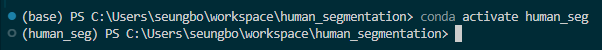
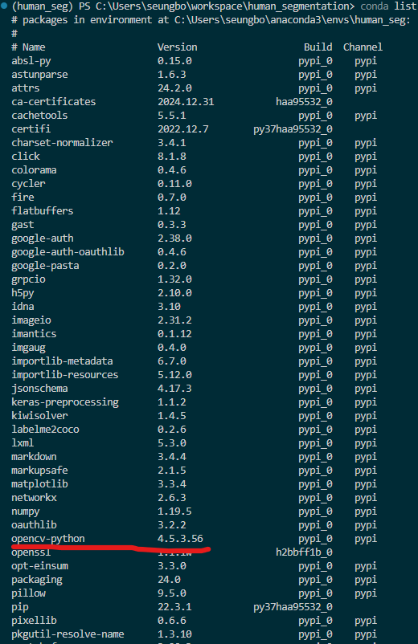

# Conda 가상환경 설정 및 패키지 설치 가이드

이 가이드는 requirements.txt 파일을 사용하여 Conda 가상환경을 설정하고 패키지를 설치하는 과정을 설명합니다.

## 설치 과정

### 1. Conda 가상환경 생성

```bash
conda create --name myenv python=3.7
```
`myenv`를 원하는 환경 이름으로 변경하고, `x`를 사용할 Python 버전으로 지정하세요.


### 2. 가상환경 활성화

```bash
conda activate myenv
```


### 3. requirements.txt 설치
```txt
# requirements.txt
opencv-python==4.5.3.56
numpy==1.19.5
pixellib==0.6.6
matplotlib==3.3.4
tensorflow==2.4.1
```


Conda를 사용하여 설치:
```bash
conda install --file requirements.txt
```

만약 일부 패키지가 Conda로 설치되지 않는다면, pip를 사용하세요:
```bash
pip install -r requirements.txt
```


### 4. 설치 확인

```bash
conda list
```



## 추가 팁

- 환경 설정을 YAML 파일로 내보내기:
  ```bash
  conda env export > environment.yml
  ```

- YAML 파일로 환경 생성하기:
  ```bash
  conda env create -f environment.yml
  ```

## 클라우드 환경 적용

이 방법은 클라우드 환경에 쉽게 적용할 수 있습니다. 환경 설정을 재현하기 쉽고, 의존성 관리가 용이하여 클라우드 배포 시 일관성 있는 환경을 구축할 수 있습니다.

로컬에서 테스트한 후 클라우드 환경에 동일한 설정을 적용하여 사용하세요.