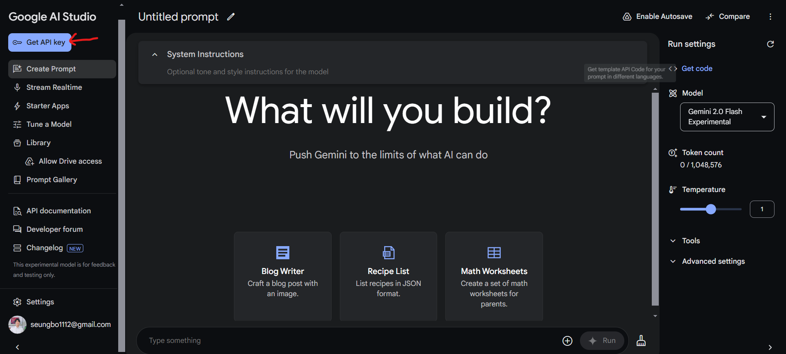
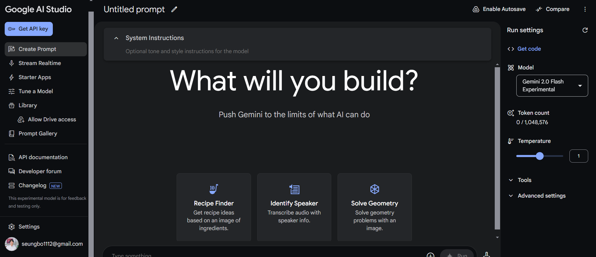
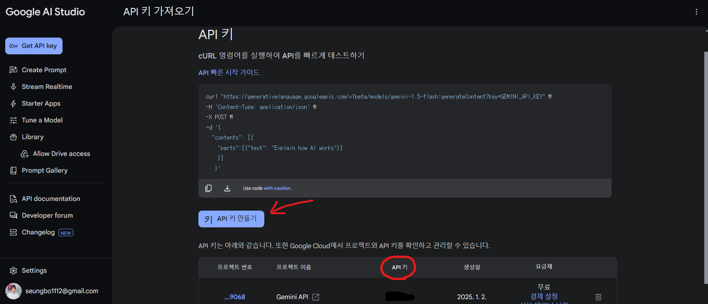
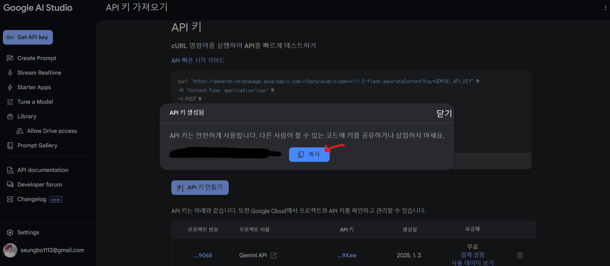
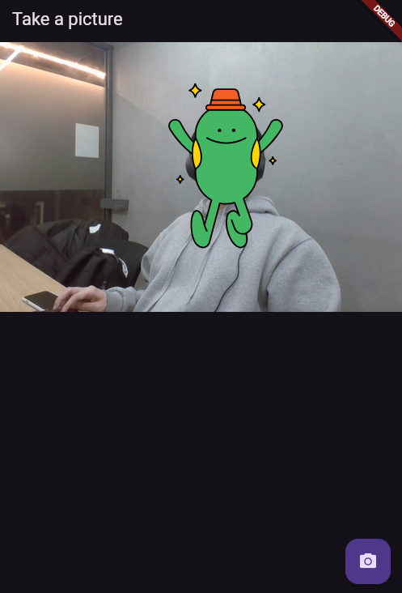
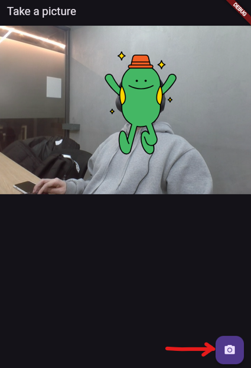
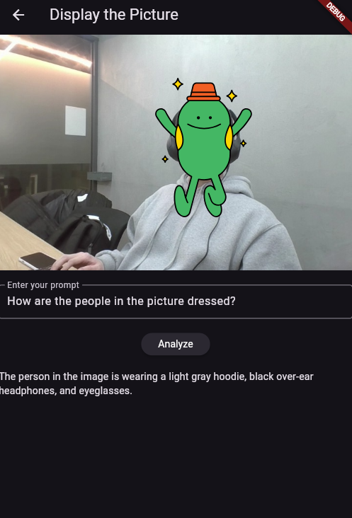
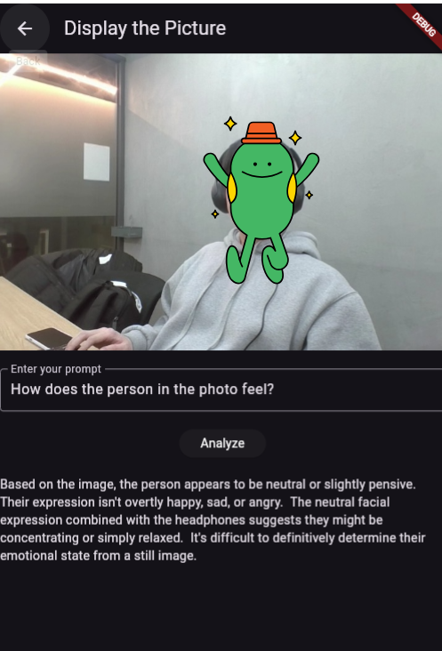

## 포스팅 개요

이번 포스팅은 Flutter를 사용하여 Gemini API를 다루는 예제입니다. 웹캠을 사용하여 사진을 촬영하고, 촬영한 사진과 프롬프트를 통해 LLM 결과를 얻는 예제를 작성합니다.

포스팅을 작성하면서 참고한 사이트는 아래와 같습니다.
- [source code](https://github.com/seungboAn/flutter_gemini_api_example)
- https://ai.google.dev/gemini-api/docs?hl=ko
- https://ai.google.dev/gemini-api/docs/get-started/tutorial?lang=dart&hl=ko#generate-text-from-text-and-image-input
- https://pub.dev/packages/google_generative_ai

## 포스팅 본문
## 1. Gemini api key 발급
#### https://aistudio.google.com/ 에 접속합니다.


#### 'Get API key' 버튼을 클릭합니다.


#### 'API 키 만들기' 버튼을 클릭하고, API 키를 생성합니다.


#### '복사' 버튼을 클릭해서 API를 복사합니다. 


## 2. 예제 코드 가져오기
#### 예제 [소스 코드](https://github.com/seungboAn/flutter_gemini_api_example.git)를 clone합니다.
```
git clone https://github.com/seungboAn/flutter_gemini_api_example.git
```

#### 필요한 패키지를 설치합니다.
```
flutter pub get
```

## 3. Gemini api key 추가
#### lib/main.dart 파일의 아래 코드에 복사한 API key를 추가하고, 저장합니다.
- Gemini 1.5 model은 multi-modal prompt을 사용할 수 있기때문에, 아래와 같이 image와 text prompt를 사용하여 LLM 결과를 얻을 수 있습니다.

```dart
// example
// const apiKey = '123wqdnkqwd124'; 
ElevatedButton(
    onPressed: () async {
        // Gemini TEST
        const apiKey = 'Your_API_KEY';
        if (apiKey == null) {
        print('No \$API_KEY environment variable');
        exit(1);
        }
        // The Gemini 1.5 models are versatile and work with both text-only and multimodal prompts
        final model =
            GenerativeModel(model: 'gemini-1.5-flash', apiKey: apiKey);
        final imageFile = await XFile(widget.imagePath).readAsBytes();
        final prompt = TextPart(_controller.text);
        final imageParts = [
        DataPart('image/jpeg', imageFile),
        ];
        final response = await model.generateContent([
        Content.multi([prompt, ...imageParts])
        ]);
        setState(() {
        _response = response.text;
        });
    },
    child: Text('Analyze', style: TextStyle(color: Colors.white)),
),
```

## 4. 프로젝트 실행
#### chrome으로 프로젝트 실행하기
```
flutter run -d chrome
```
- 아래와 같이 실행되면 사진 촬영과 프롬프트를 입력할 준비가 완료됩니다.



## 5. 사진 촬영 및 prompt 입력하기
#### 카메라 아이콘을 클릭해서 사진을 촬영합니다.


#### 프롬프트를 입력합니다.
- 간단한 테스트를 위해 아래와 같은 프롬프트를 입력하고, Analyze 버튼을 클릭해서 LLM 결과를 얻어보겠습니다.
- `How are the people in the picture dressed?`

- 회색 후드, 검은 헤드폰, 안경을 쓰고 있다고 하네요.

- `How does the person in the photo feel?`
