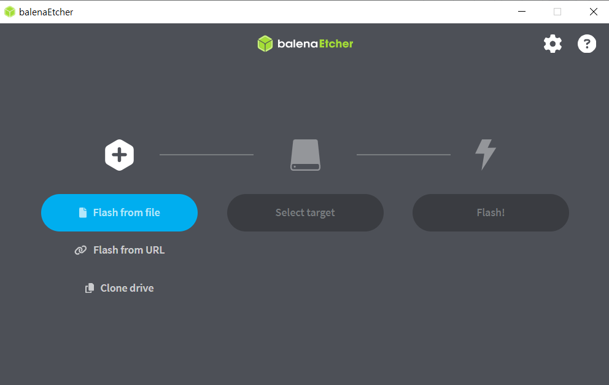

**목표:** MangoPi MQ-Quad (H616) 보드를 Windows 노트북을 이용하여 성공적으로 부팅하고, 운영체제에 접근합니다.

**준비물:**

*   MangoPi MQ-Quad (H616) 보드
*   MicroSD 카드 (8GB 이상, Class 10 권장)
*   MicroSD 카드 리더기
*   USB-C 케이블
*   Windows 노트북
*   운영체제 이미지 (Armbian, Ubuntu 등, [https://mangopi.org/mqquad](https://mangopi.org/mqquad) 에서 다운로드)
*   Etcher (MicroSD 카드 굽기 프로그램, [https://etcher.balena.io/](https://etcher.balena.io/) 에서 다운로드)
*   터미널 프로그램 (PuTTY, Tera Term 등)
*   (선택 사항) HDMI 케이블 및 모니터
*   (선택 사항) USB 키보드 및 마우스

**절차:**

1.  **운영체제 이미지 다운로드:** [https://mangopi.org/mqquad](https://mangopi.org/mqquad) 에서 MangoPi MQ-Quad (H616)에 적합한 운영체제 이미지 (Armbian, Ubuntu 등)를 다운로드합니다.
2.  **MicroSD 카드 굽기:**
    *   Etcher (또는 다른 MicroSD 카드 굽기 프로그램)를 실행합니다.
    *   "Flash from file"을 클릭하고 다운로드한 운영체제 이미지 파일을 선택합니다.
    *   "Select target"을 클릭하고 MicroSD 카드를 선택합니다. (주의: 잘못된 드라이브를 선택하면 데이터가 삭제될 수 있습니다.)
    *   "Flash!" 버튼을 클릭하여 MicroSD 카드에 이미지를 굽습니다.
    *   굽기가 완료되면 Etcher를 종료하고 MicroSD 카드를 안전하게 제거합니다.
3.  **MangoPi MQ-Quad 연결:**
    *   MicroSD 카드를 MangoPi MQ-Quad 보드에 삽입합니다.
    *   USB-C 케이블을 이용하여 MangoPi MQ-Quad 보드를 Windows 노트북에 연결합니다.
    *   (선택 사항) HDMI 케이블을 이용하여 모니터에 연결합니다.
    *   (선택 사항) 키보드 및 마우스를 USB 포트에 연결합니다.
4.  **전원 공급 및 부팅:** MangoPi MQ-Quad 보드에 전원을 공급합니다.
5.  **(선택 사항) 모니터 확인:** HDMI 모니터를 연결한 경우, MangoPi MQ-Quad 보드가 정상적으로 부팅되는지 모니터를 통해 확인할 수 있습니다.
6.  **터미널 접속 (모니터 연결 없이):**
    *   Windows 노트북에서 터미널 프로그램 (PuTTY, Tera Term 등)을 실행합니다.
    *   MangoPi MQ-Quad 보드의 IP 주소 (DHCP 할당) 또는 시리얼 포트를 확인합니다. (IP 주소 확인 방법은 아래 트러블 슈팅 참고)
    *   터미널 프로그램을 이용하여 MangoPi MQ-Quad 보드에 접속합니다.
        *   **SSH (IP 주소):** IP 주소를 사용하여 SSH로 접속합니다. (예: `ssh root@192.168.1.100`)
        *   **Serial (시리얼 포트):** 시리얼 포트 (COM 포트)를 사용하여 접속합니다. (보드 레이트: 115200, 데이터 비트: 8, 패리티: None, 스톱 비트: 1)
7.  **로그인:** 운영체제 이미지의 기본 사용자 이름과 비밀번호를 입력하여 로그인합니다. (Armbian의 기본 사용자 이름은 `root`, 비밀번호는 `1234`이며, 처음 로그인 시 비밀번호 변경을 요구합니다.)

## 트러블 슈팅

**문제:** MangoPi MQ-Quad 보드가 부팅되지 않거나, 모니터에 화면이 표시되지 않습니다.

**원인:**

*   **부팅 파일 문제:** MicroSD 카드에 있는 부팅 파일이 손상되었을 가능성이 가장 높습니다. 기존에 설치된 운영체제의 부팅 파일이 손상되어 정상적인 부팅이 불가능할 수 있습니다.
*   MicroSD 카드 문제:** MicroSD 카드가 손상되었거나, 용량이 부족하거나, 속도가 느릴 수 있습니다.
*   운영체제 이미지 문제:** 운영체제 이미지 파일이 손상되었거나, MangoPi MQ-Quad 보드에 호환되지 않을 수 있습니다.
*   전원 공급 문제:** MangoPi MQ-Quad 보드에 충분한 전력이 공급되지 않을 수 있습니다.
*   하드웨어 문제:** MangoPi MQ-Quad 보드 자체에 하드웨어 문제가 있을 수 있습니다.

**해결 방법:**

1.  **가장 중요한 해결책: 운영체제 이미지 재설치 (부팅 파일 Flash):** Etcher를 사용하여 운영체제 이미지를 MicroSD 카드에 **새로 굽습니다.** 이 과정은 MicroSD 카드를 포맷하고, 운영체제 이미지를 굽는 것을 포함하여, **부팅 파일 문제를 해결하는 가장 확실한 방법입니다.** [https://mangopi.org/mqquad](https://mangopi.org/mqquad) 에서 최신 운영체제 이미지를 다운로드하여 사용하십시오.

2.  MicroSD 카드 교체:** 다른 MicroSD 카드를 사용하여 부팅을 시도해 봅니다.
3.  운영체제 이미지 문제 확인:  운영체제 이미지 파일을 다시 다운로드하고, Etcher를 사용하여 MicroSD 카드에 다시 굽습니다 (위 1번과 동일).
4.  전원 공급 확인:** USB-C 케이블과 전원 어댑터가 정상적으로 작동하는지 확인합니다. 다른 케이블과 어댑터를 사용해 봅니다.

**핵심:** 부팅 문제 발생 시, **가장 먼저 운영체제 이미지를 새로 Flash하는 것이 문제 해결의 핵심입니다.**

## 키워드 설명

*   **SBC (Single Board Computer):** 하나의 보드에 CPU, 메모리, 입출력 장치 등 컴퓨터의 모든 구성 요소를 통합한 컴퓨터입니다. MangoPi MQ-Quad (H616)은 SBC의 일종입니다.
*   **MicroSD 카드:** 휴대용 장치에서 주로 사용되는 소형 플래시 메모리 카드입니다. MangoPi MQ-Quad 보드의 운영체제 및 데이터를 저장하는 데 사용됩니다.
*   **운영체제 이미지:** 운영체제를 설치하기 위한 파일입니다. MangoPi MQ-Quad 보드에 설치할 수 있는 운영체제 이미지로는 Armbian, Ubuntu 등이 있습니다.
*   **Etcher:** MicroSD 카드 또는 USB 드라이브에 운영체제 이미지를 굽는 데 사용되는 무료 오픈 소스 프로그램입니다. 사용하기 쉽고 안전하여 초보자에게 적합합니다. **부팅 파일을 새로 생성하고 MicroSD 카드를 포맷하는 기능을 포함합니다.**
*   **터미널:** 텍스트 기반 인터페이스를 통해 컴퓨터와 상호 작용하는 데 사용되는 프로그램입니다. MangoPi MQ-Quad 보드에 접속하여 명령을 실행하고 시스템을 관리할 수 있습니다.
*   **SSH (Secure Shell):** 네트워크를 통해 안전하게 원격 컴퓨터에 접속하는 데 사용되는 프로토콜입니다. MangoPi MQ-Quad 보드에 원격으로 접속하여 시스템을 관리할 수 있습니다.
*   **DHCP (Dynamic Host Configuration Protocol):** 네트워크에 연결된 장치에 자동으로 IP 주소, 서브넷 마스크, 게이트웨이 주소 등을 할당하는 데 사용되는 프로토콜입니다. MangoPi MQ-Quad 보드가 네트워크에 연결되면 DHCP를 통해 IP 주소를 할당받습니다.
*   **시리얼 콘솔:** 시리얼 통신을 통해 컴퓨터에 접속하는 방법입니다. 부팅 과정에서 발생하는 오류 메시지를 확인하거나, 네트워크 연결 없이 시스템을 복구하는 데 유용합니다.
*   **부트 로더:** 운영체제를 로드하기 전에 실행되는 작은 프로그램입니다. MangoPi MQ-Quad 보드의 부팅 과정을 초기화하고 운영체제를 로드하는 역할을 합니다.

**참고**
- https://mangopi.org/mqquad