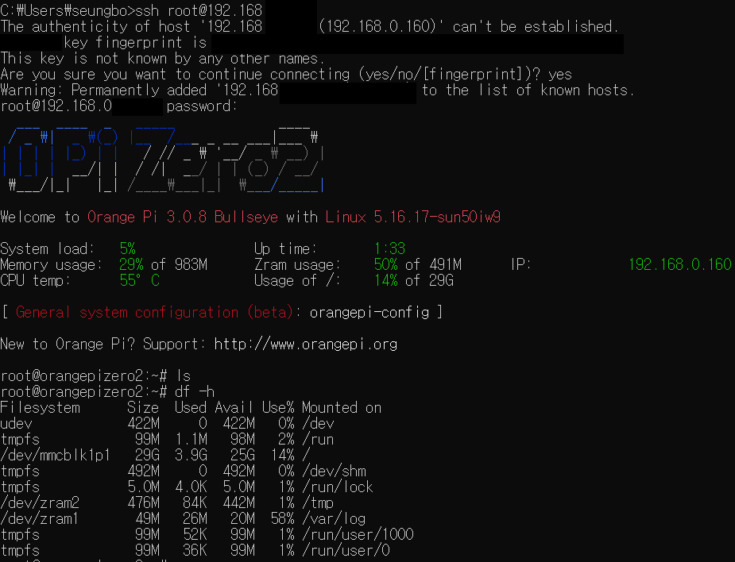

**목표:** SSH를 통해 MangoPi에 접속한 후, Python이 정상적으로 설치되어 있는지 확인하고 "Hello, World!" 프로그램을 실행합니다.

**사전 준비:**

*   MangoPi 보드 (OS 설치 및 네트워크 연결 완료)
*   SSH 클라이언트 (PuTTY, Terminal 등)
*   MangoPi의 IP 주소
*   MangoPi 사용자 계정 정보 (username, password)

**절차:**

1.  **SSH를 사용하여 MangoPi에 접속합니다.**
    *   터미널 (Linux/macOS) 또는 PuTTY (Windows)를 실행합니다.
    *   다음 명령어를 입력하여 MangoPi에 접속합니다.

    ```bash
    ssh <username>@<ip_address>
    ```

    *   `<username>`: MangoPi의 사용자 이름 (예: `root`)
    *   `<ip_address>`: MangoPi의 IP 주소 (예: `192.168.1.100`)
    *   비밀번호를 입력하라는 메시지가 표시되면, MangoPi 계정의 비밀번호를 입력합니다.



2.  **패키지 목록 업데이트:**
    *   MangoPi에 접속한 후, 다음 명령어를 입력하여 패키지 목록을 업데이트합니다.

    ```bash
    sudo apt update
    ```

    *   이 명령어는 MangoPi에 설치된 패키지들의 최신 버전 정보를 가져옵니다.
    *   업데이트 과정에서 암호를 묻는 경우, 사용자 암호를 입력합니다.


3.  **Python 3 설치 확인:**
    *   다음 명령어를 입력하여 Python 3가 설치되어 있는지 확인합니다.

    ```bash
    python3 --version
    ```

    *   Python 3의 버전 정보가 출력되면 Python 3가 이미 설치된 것입니다.
    *   만약 Python 3가 설치되어 있지 않다면, 다음 단계를 진행합니다.

4.  **Python 3 설치 (필요한 경우):**
    *   다음 명령어를 입력하여 Python 3를 설치합니다.

    ```bash
    sudo apt install python3
    ```

    *   설치 과정에서 암호를 묻는 경우, 사용자 암호를 입력합니다.
    *   설치 확인 메시지가 나타나면 `y`를 입력하고 Enter 키를 누릅니다.


5.  **pip (Python 패키지 관리자) 설치:**
        *   `pip`는 Python 패키지를 설치하고 관리하는 데 사용되는 도구입니다. 필요에 따라 pip를 설치합니다.

        ```bash
        sudo apt install python3-pip
        ```
6.  **"Hello, World!" 테스트:**
