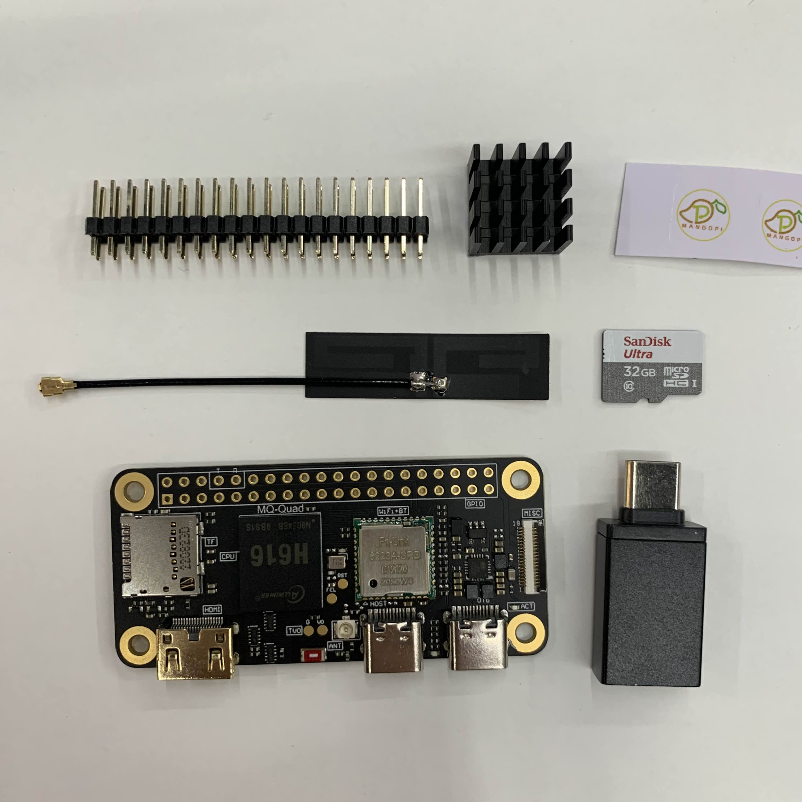

**소개**

MangoPi MQ-Quad (H616)은 쿼드 코어 Cortex-A53 프로세서를 탑재한 소형 단일 보드 컴퓨터입니다. 제한적인 하드웨어 성능에도 불구하고 다양한 센서 및 통신 인터페이스를 제공하여 IoT 및 임베디드 시스템 분야에서 AI를 활용할 수 있는 잠재력을 지니고 있습니다. 본 가이드는 MangoPi MQ-Quad (H616)의 구성 요소와 AI 활용 가능성을 심층적으로 분석하고, 간단한 LLM 테스트를 통해 사용자가 효과적으로 활용할 수 있도록 돕는 것을 목표로 합니다.

**1. 주요 부품 분석**

*   **Allwinner H616 SoC (System on a Chip)**

    *   **핵심 기능:** MangoPi MQ-Quad의 두뇌 역할을 수행하며, CPU, GPU, VPU, 메모리 컨트롤러를 통합했습니다.
        *   **CPU (쿼드 코어 Cortex-A53):** 기본적인 머신러닝 모델을 실행할 수 있습니다. 연산량이 많은 작업에는 한계가 있습니다.
        *   **GPU (Mali-G31 MP2):** OpenCL/OpenGL ES를 활용하여 병렬 연산을 가속화하고 머신러닝 추론 성능을 향상시킬 수 있지만, 고사양 GPU에 비해 성능은 제한적입니다. TensorFlow Lite GPU Delegate를 사용하면 효율적인 추론이 가능합니다.
        *   **VPU (비디오 처리 장치):** 이미지/비디오 처리 관련 AI 모델 (예: 객체 감지, 얼굴 인식)의 전처리 또는 후처리 단계에서 활용하여 효율성을 높일 수 있습니다.
    *   **AI 활용 전략:**
        *   CPU: 간단한 제어 로직이나 데이터 전처리 등 가벼운 작업에 활용합니다.
        *   GPU: OpenCL/OpenGL ES를 활용하여 병렬 연산이 필요한 부분을 가속화합니다. TensorFlow Lite GPU Delegate를 사용하여 효율적인 추론이 가능합니다.
        *   VPU: 이미지/비디오 데이터의 디코딩/인코딩을 가속화하여 AI 모델의 성능을 높입니다.
*   **RAM (Eldiatwn J818E8MB)**

    *   **역할:** 프로그램 실행 및 데이터 저장을 위한 임시 메모리 공간을 제공합니다.
    *   **AI 활용:**
        *   머신러닝 모델 실행 시 필요한 데이터를 RAM에 올려놓고 사용합니다. 충분한 RAM 용량은 모델 크기 및 배치 사이즈에 따라 AI 성능에 결정적인 영향을 미칩니다.
    *   **최적화 전략:**
        *   모델 크기를 줄이고, 배치 사이즈를 조정하여 RAM 사용량을 최적화합니다.
        *   메모리 누수를 방지하고 효율적인 메모리 관리를 위해 프로그래밍 기법을 적용합니다.
*   **저장 장치 (SanDisk Ultra 32GB microSD)**

    *   **기능:** 운영체제, 프로그램, 데이터 등을 저장합니다.
    *   **AI 활용:**
        *   머신러닝 모델, 데이터셋, 학습 결과 등을 저장합니다.
        *   AI 추론 시 필요한 모델 파일을 SD 카드에서 읽어옵니다.
    *   **성능 고려사항:**
        *   SD 카드의 읽기/쓰기 속도는 AI 추론 성능에 영향을 미칠 수 있습니다. 고성능 SD 카드를 사용하는 것이 좋습니다.
        *   저장 공간이 부족하면 모델 학습이나 데이터 저장에 어려움이 있을 수 있습니다. 필요에 따라 더 큰 용량의 SD 카드를 사용합니다.
*   **Fn-Link 6223A-SRD (Wi-Fi/BT 모듈)**

    *   **기능:** 무선 네트워크 (Wi-Fi) 및 블루투스 연결을 지원합니다.
    *   **AI 활용:**
        *   클라우드 기반 AI 서비스와 연동하여 데이터를 주고받거나, 원격으로 AI 모델을 업데이트할 수 있습니다.
        *   블루투스를 통해 센서 데이터를 수집하고, AI 모델을 통해 분석할 수 있습니다.
    *   **활용 전략:**
        *   Wi-Fi: 클라우드 기반 AI 서비스 연동, 모델 업데이트, 원격 제어 등에 활용합니다.
        *   Bluetooth: 센서 데이터 수집, 주변 기기 연결 등에 활용합니다.
*   **GPIO (General Purpose Input/Output) 핀**

    *   **기능:** 외부 센서, 액추에이터, 기타 하드웨어와 연결하여 데이터를 주고받고 제어하는 데 사용됩니다.
    *   **AI 활용:**
        *   센서 데이터를 수집하여 AI 모델 학습에 사용하거나, AI 모델 추론 결과를 바탕으로 액추에이터를 제어할 수 있습니다 (예: 스마트 홈, 로봇 제어).
    *   **활용 예시:**
        *   온도/습도 센서 데이터를 수집하여 실내 환경을 모니터링하고, 쾌적한 환경을 유지하도록 에어컨이나 가습기를 제어합니다.
        *   카메라를 연결하여 객체를 감지하고, 특정 객체가 감지되면 알람을 울리거나 액추에이터를 작동시킵니다.

**2. 기타 구성 요소 및 연결 포트**

*   **방열판:** H616 SoC에서 발생하는 열을 효율적으로 식혀줍니다. AI 모델 실행 시 연산량이 많아지면 발열이 심해지므로 방열판은 필수적입니다.
*   **안테나:** Wi-Fi/BT 모듈과 연결하여 무선 통신 거리를 늘려줍니다. 안정적인 무선 연결을 위해 적절한 안테나를 선택해야 합니다.
*   **USB 어댑터:** 전원 공급 및 USB 장치 연결에 사용됩니다. 안정적인 전원 공급은 시스템의 안정적인 작동에 매우 중요합니다.
*   **OTG (USB On-The-Go):** 전원 공급 및 USB 장치 연결에 사용됩니다.
*   **Host (USB Host):** USB 장치를 연결하여 데이터 전송에 사용됩니다.
*   **Mini HDMI:** 모니터 연결을 위한 포트입니다.
*   **MISC:** 카메라 등의 기타 장치 연결을 위한 포트입니다.
*   **헤더 핀:** GPIO 핀에 쉽게 접근할 수 있도록 연결해주는 역할을 합니다. 다양한 외부 장치를 연결하여 시스템의 기능을 확장할 수 있습니다.

**3. AI 활용 시 고려 사항 (하드웨어 전문가의 조언)**

*   **제한적인 하드웨어 성능:** H616은 저전력 칩셋이므로, 고사양 AI 모델을 실행하기에는 성능이 부족할 수 있습니다.
    *   **해결책:**
        *   **모델 경량화:** TensorFlow Lite, PyTorch Mobile 등 경량화된 모델을 사용합니다.
        *   **클라우드 기반 AI 서비스 활용:** 모델 학습 및 추론을 클라우드에서 수행하고, 결과를 받아오는 방식을 고려합니다.
        *   **최적화된 코딩:** 불필요한 연산을 줄이고 효율적인 코딩을 통해 성능을 향상시킵니다.
*   **소프트웨어 지원:** MangoPi MQ-Quad에 대한 AI 관련 소프트웨어 (예: TensorFlow Lite, PyTorch Mobile) 지원 여부를 확인해야 합니다.
    *   **확인 방법:**
        *   MangoPi 공식 웹사이트 또는 커뮤니티를 통해 정보를 확인합니다.
        *   TensorFlow Lite 또는 PyTorch Mobile의 호환성 목록을 확인합니다.
*   **전력 소비:** AI 모델 실행 시 전력 소비가 증가하므로, 전원 공급 장치 용량을 충분히 확보해야 합니다.
    *   **전력 관리:**
        *   전력 소비를 줄이기 위해 CPU 클럭 속도를 조절합니다.
        *   불필요한 기능을 끄고 전력 소비를 최소화합니다.
        *   배터리 사용 시간을 늘리기 위해 전력 관리 모드를 활용합니다.