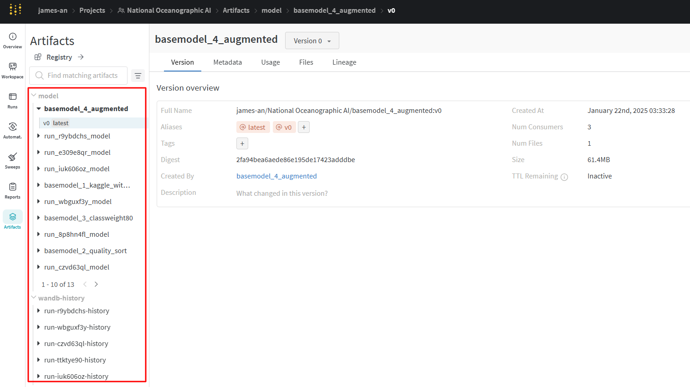

# Weights & Biases Artifact를 활용한 모델 다운로드 및 사용하기

머신러닝 프로젝트에서 모델 관리는 매우 중요합니다. Weights & Biases(wandb)의 Artifact 기능은 이러한 모델 관리를 효율적으로 할 수 있게 해주는 강력한 도구입니다. 이번 포스트에서는 wandb Artifact를 사용하여 모델을 다운로드하고 로컬에서 사용하는 방법에 대해 알아보겠습니다.

## 개요

- wandb Artifact란?
- Artifact를 사용한 모델 다운로드 코드 설명
- 코드 실행 결과 및 활용 방안

## wandb Artifact 소개

wandb Artifact는 머신러닝 실험에서 사용되는 데이터셋, 모델, 결과물 등을 버전 관리하고 추적할 수 있게 해주는 기능입니다. Artifact를 사용하면 모델의 여러 버전을 쉽게 관리하고, 필요할 때 특정 버전을 빠르게 다운로드하여 사용할 수 있습니다

## Artifact 목록 확인


## 모델 다운로드 코드 설명

다음은 wandb Artifact를 사용하여 여러 모델을 다운로드하는 파이썬 코드입니다:

```python
import wandb
import os

# 현재 디렉토리를 기준으로 모델 저장 경로 설정
MODEL_DIR = os.getcwd()
os.makedirs(MODEL_DIR, exist_ok=True)

# Initialize wandb run
run = wandb.init(project="National Oceanographic AI", job_type="model_download")

# List of model artifacts to download
model_artifacts = [
    'james-an/National Oceanographic AI/basemodel_4_augmented:v0',
    'james-an/National Oceanographic AI/basemodel_1_kaggle_without_aug:v0',
    'james-an/National Oceanographic AI/basemodel_3_classweight80:v1',
    'james-an/National Oceanographic AI/basemodel_2_quality_sort:v0'
]

# Download and store artifacts
for artifact_path in model_artifacts:
    artifact = run.use_artifact(artifact_path, type='model')
    artifact_dir = artifact.download(root=MODEL_DIR)
    print(f"Downloaded {artifact_path} to {artifact_dir}")

# Finish the wandb run
run.finish()

print(f"All models have been downloaded to {MODEL_DIR}")
```

이 코드는 다음과 같은 단계로 작동합니다:

1. wandb run을 초기화합니다.
2. 다운로드할 모델 Artifact 목록을 정의합니다.
3. 각 Artifact를 순회하며 `use_artifact()` 메소드로 Artifact를 가져옵니다[3].
4. `download()` 메소드를 사용하여 Artifact를 로컬 디렉토리에 다운로드합니다[4].
5. 다운로드 완료 후 wandb run을 종료합니다.

## 코드 실행 결과 및 활용 방안

이 코드를 실행하면, 지정된 모델 Artifact들이 현재 작업 디렉토리에 다운로드됩니다. 다운로드된 모델들은 추후 모델 평가, 앙상블 학습, 또는 추가 fine-tuning 등 다양한 용도로 활용할 수 있습니다.

## 결론

wandb Artifact를 활용하면 모델 버전 관리와 재사용이 매우 간편해집니다. 이는 특히 팀 프로젝트나 장기적인 AI 연구에서 큰 도움이 될 수 있습니다. Artifact를 통해 모델의 이력을 추적하고, 필요한 시점의 모델을 쉽게 가져와 사용할 수 있어 실험의 재현성과 효율성을 크게 높일 수 있습니다.

## 참고 자료

1. [Weights & Biases Documentation - Artifacts](https://docs.wandb.ai/guides/artifacts/)
2. [Weights & Biases Documentation - Download and use artifacts](https://docs.wandb.ai/guides/artifacts/download-and-use-an-artifact/)
3. [Weights & Biases Documentation - Artifact Python SDK](https://docs.wandb.ai/ref/python/artifact/)

이상으로 wandb Artifact를 활용한 모델 다운로드 및 사용 방법에 대한 포스팅을 마치겠습니다. 여러분의 AI 프로젝트에 이 기능을 활용해보시기 바랍니다!