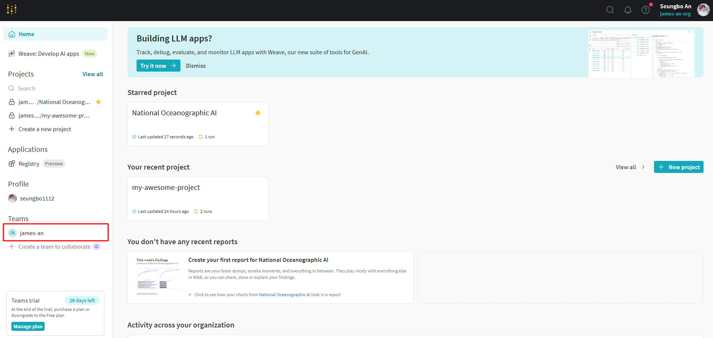
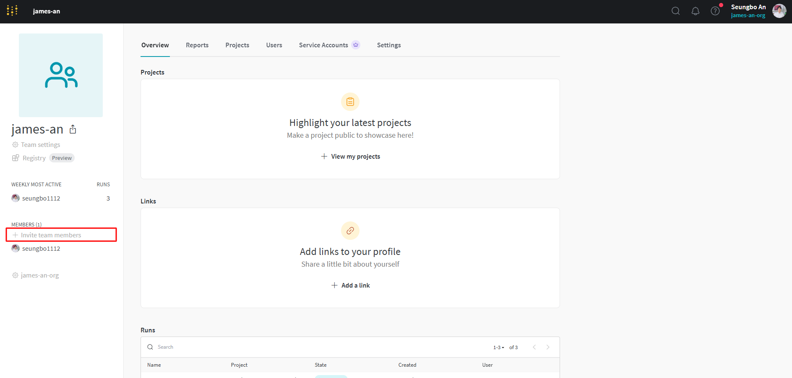
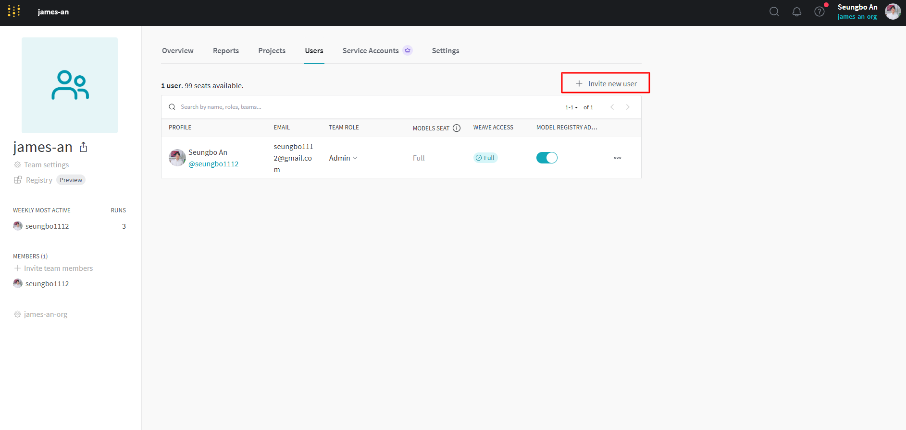
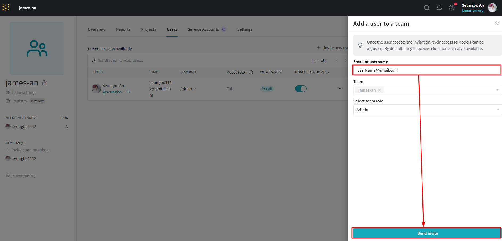
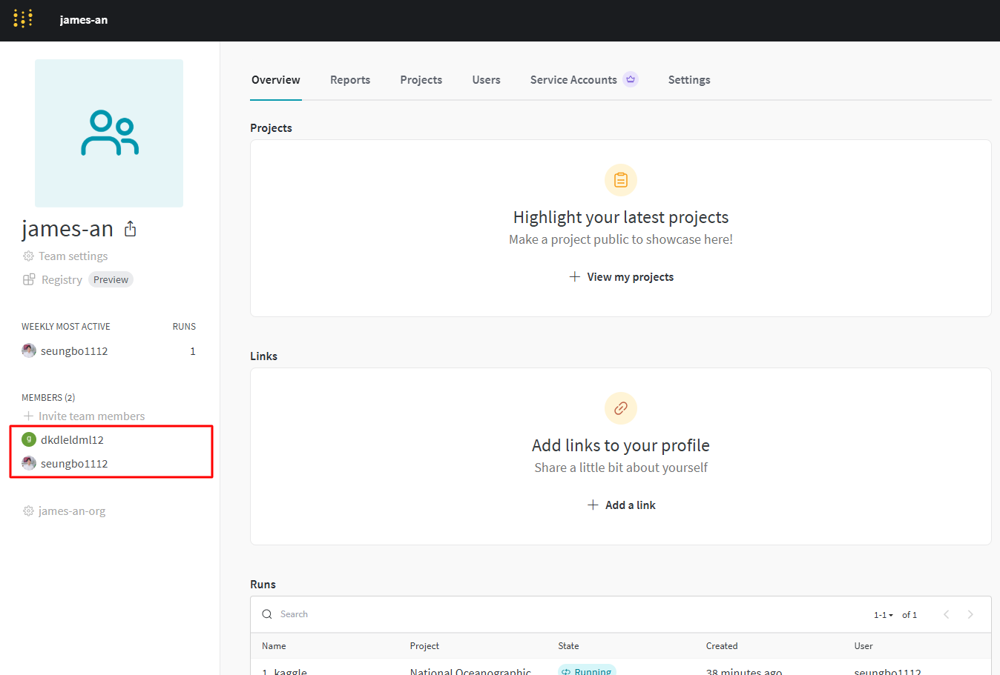

## 포스팅 개요

Weights & Biases (W&B)는 ML 프로젝트의 협업 효율성을 크게 향상시키는 강력한 도구입니다. ML 실험을 팀과 생산성 있게 수행하기 위해 W&B를 사용해야 합니다.

W&B의 주요 기능은 다음과 같습니다:
- 중앙 집중식 실험 추적: 모든 ML 모델, 데이터셋, 실험을 단일 플랫폼에서 통합하여 팀원들과 쉽게 공유할 수 있습니다1.
- 실시간 협업: 팀원들과 함께 실험을 실행하고 즉시 결과를 공유할 수 있습니다1.
- 버전 관리 및 재현성: 과거 모델을 쉽게 재현하고 데이터셋과 프로세스를 명확하게 추적할 수 있습니다12.
- ML 프로젝트 개선: GitHub와 유사하게, W&B를 사용하면 팀원들과 효과적으로 협업하면서 ML 프로젝트를 관리하고 개선할 수 있습니다1.
- 실시간 지표 추적: 훈련 중에 손실, 정확도 및 유효성 검사 점수와 같은 메트릭을 관찰하여 모델 조정을 위한 즉각적인 인사이트를 얻을 수 있습니다1.
- 하이퍼파라미터 최적화: 학습 속도, 배치 크기 등과 같은 중요 파라미터를 미세 조정하여 모델의 성능을 향상시킬 수 있습니다

## 포스팅 본문

## 1. https://wandb.ai 사이트에 접속 후 로그인합니다.

## 2. `home`에서 협업할 팀을 선택합니다.

## 3. `Invited team members`를 클릭합니다.

## 4. `Invite new user`를 클릭합니다.

## 5. 협업할 팀원의 이메일 혹은 아이디를 입력하고 `Send Invite`를 클릭합니다.

## 6. 초대가 완료되면, 팀원 목록에 추가됩니다.

## 7. 

## 참고
- https://docs.wandb.ai/tutorials/experiments/
- https://wandb.ai/wandb/wandb_example?nw=nwuser_scott