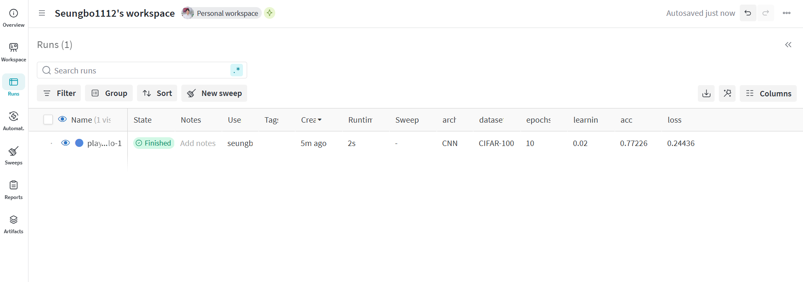

## 포스팅 개요

이 포스팅은 기계 학습 실험 추적 및 시각화를 위한 인기 있는 플랫폼인 Weights & Biases (W&B)의 설정 및 사용에 대한 종합적인 가이드를 제공합니다. W&B 계정 생성, W&B 패키지 설치, 샘플 실험 실행, 그리고 W&B 대시보드에서 결과를 탐색하는 과정을 단계별로 안내합니다.

포스팅을 작성하면서 참고한 사이트는 아래와 같습니다.
- [source code](https://github.com/seungboAn/wandb_example/blob/main/main.py)
- https://wandb.ai/

## 포스팅 본문

1. https://wandb.ai/site/ko/ 사이트에 접속합니다.

2. **가입하기** 버튼을 클릭합니다.


3. 회원 정보를 입력합니다.


4. 조직 이름을 입력합니다.


5. **W&B Models**를 선택하고, `pip install wandb`를 통해 설치합니다.


6. `wandb login`을 입력하고, API키를 복사해서 붙여넣습니다.


7. API가 등록되면 `wandb login`을 입력해서 로그인이 되었는지 확인합니다.


8. 아래 샘플 코드를 복사해서 임의의 모델을 생성합니다.
```python
import wandb
import random

# start a new wandb run to track this script
wandb.init(
    # set the wandb project where this run will be logged
    project="my-awesome-project",

    # track hyperparameters and run metadata
    config={
    "learning_rate": 0.02,
    "architecture": "CNN",
    "dataset": "CIFAR-100",
    "epochs": 10,
    }
)

# simulate training
epochs = 10
offset = random.random() / 5
for epoch in range(2, epochs):
    acc = 1 - 2 ** -epoch - random.random() / epoch - offset
    loss = 2 ** -epoch + random.random() / epoch + offset

    # log metrics to wandb
    wandb.log({"acc": acc, "loss": loss})

# [optional] finish the wandb run, necessary in notebooks
wandb.finish()
```

9. `python main.py`를 통해 실행합니다.

10. 모델의 결과를 대시보드에서 확인합니다.


11. Runs 탭에서 실행된 모델의 설정을 확인합니다.

```python
# track hyperparameters and run metadata
    config={
    "learning_rate": 0.02,
    "architecture": "CNN",
    "dataset": "CIFAR-100",
    "epochs": 10,
    }
```

12. 새로운 config를 추가해서 실행해보고 비교합니다.


## 결론
- W&B를 신속하게 설정하고 기계 학습 실험 추적을 시작할 수 있습니다. 제공된 샘플 코드는 메트릭, 하이퍼파라미터 및 기타 관련 정보를 로깅하는 과정이 얼마나 간단한지 보여줍니다.
- W&B 대시보드의 직관적인 시각화 도구는 다양한 실험 결과를 쉽게 비교할 수 있게 해주며, 이는 데이터 과학자와 기계 학습 엔지니어들이 모델을 더욱 효과적으로 최적화하는 데 도움이 됩니다.

다음 포스팅에서는 이를 바탕으로 실제 프로젝트에 W&B를 연동하는 구체적인 예제를 다룰 예정입니다. 이를 통해 AI 프로젝트에서의 실험 관리, 재현성, 그리고 팀 협업을 더욱 효과적으로 수행하는 방법을 자세히 알아보겠습니다.